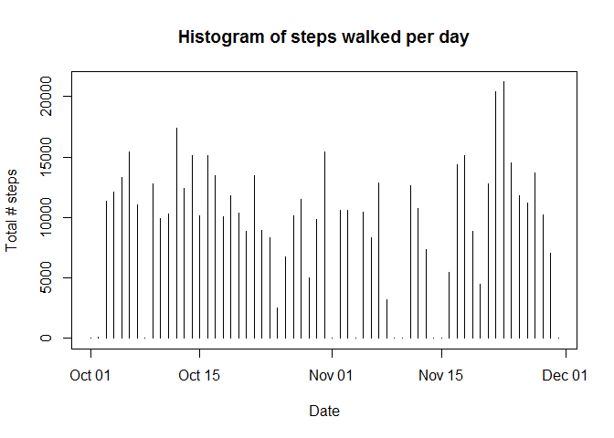
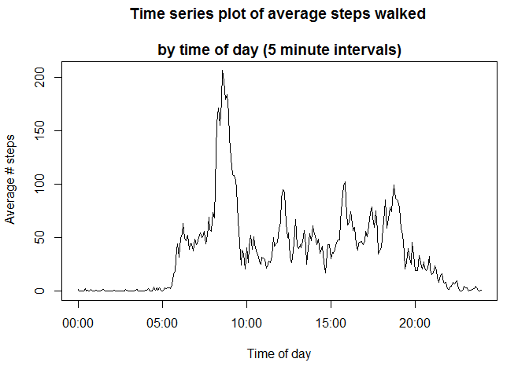
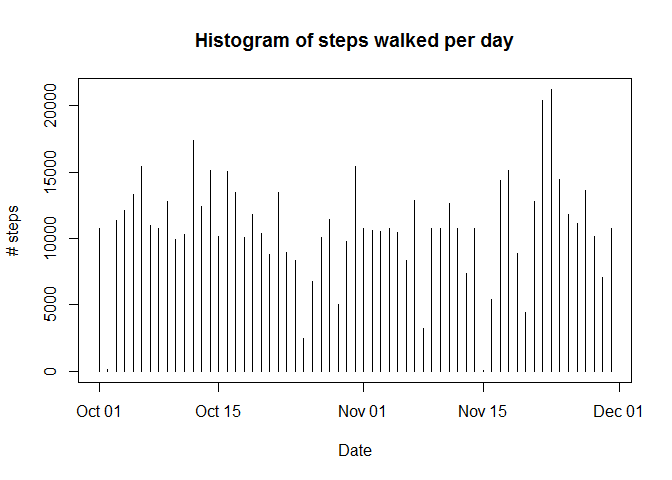
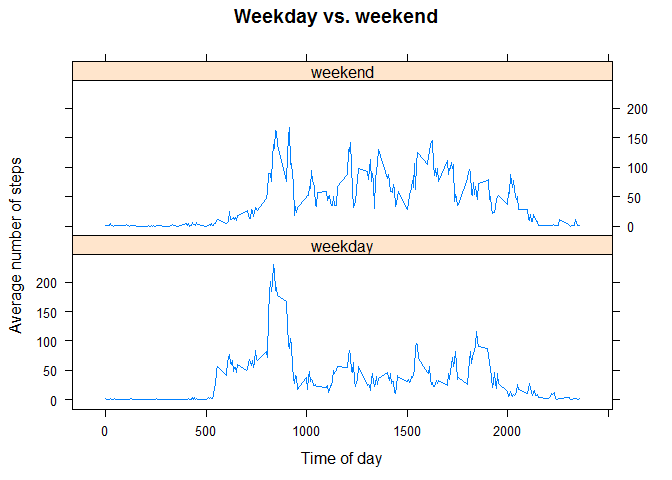

# Reproducible Research Project 1


### Introduction

It is now possible to collect a large amount of data about personal movement using activity monitoring devices such as a Fitbit, Nike Fuelband, or Jawbone Up. These type of devices are part of the “quantified self” movement – a group of enthusiasts who take measurements about themselves regularly to improve their health, to find patterns in their behavior, or because they are tech geeks. But these data remain under-utilized both because the raw data are hard to obtain and there is a lack of statistical methods and software for processing and interpreting the data.

This assignment makes use of data from a personal activity monitoring device. This device collects data at 5 minute intervals through out the day. The data consists of two months of data from an anonymous individual collected during the months of October and November, 2012 and include the number of steps taken in 5 minute intervals each day.

### Data

The data for this assignment can be downloaded from the course web site:

- Dataset: Activity monitoring data [52K]

The variables included in this dataset are:

- steps: Number of steps taking in a 5-minute interval (missing values are coded as NA)

- date: The date on which the measurement was taken in YYYY-MM-DD format

- interval: Identifier for the 5-minute interval in which measurement was taken

The dataset is stored in a comma-separated-value (CSV) file and there are a total of 17,568 observations in this dataset.

### Loading and preprocessing the data

*1. Load the data (i.e. read.csv())*

*2.Process/transform the data (if necessary) into a format suitable for your analysis*

Data is loaded from the supplied file "*activity.csv*".  The "*interval*" field in the file is decimal numbers of the 5-minute intervals.  First step is to convert them to time (hours, minutes).  The date field in the file is text, needs to be converted to type Date.


```r
## Load data, identify NA values
data <- read.csv("activity.csv", header=TRUE, sep=",", na.strings = "NA",
    stringsAsFactors = FALSE)

data$dateTime <- strptime(sprintf("%s %02d:%02d", data$date, 
    data$interval %/% 100, data$interval %% 100),"%Y-%m-%d %H:%M")

data$date <- as.Date(data$date)
```

### What is total number of steps taken per day?

*For this part of the assignment, you can ignore the missing values in the dataset.*

To make a histogram of the number of steps walked each day, and to calculate the mean and median number of steps per day, we will create a table summarizing the total number of steps for each day, using the *aggregate()* function.


```r
## Summarize total steps per day
dataStepsByDay <- aggregate(data$steps, by=list(data$date), 
      FUN=sum, na.rm=TRUE)

names(dataStepsByDay) <- c("date", "totalSteps") # fix headings
```

*1. Make a histogram of the total number of steps taken each day.*


```r
## Plot number of steps walked by day
plot(dataStepsByDay$date,dataStepsByDay$totalSteps, type="h",
    xlab="Date",ylab="Total # steps",
    main="Histogram of steps walked per day")
```

 

*2. Calculate and report the mean and median total number of steps taken per day.*


```r
## Calculate and print mean number of steps per day
dailyMeanSteps <- round(mean(dataStepsByDay$totalSteps, na.rm=TRUE))
print(sprintf("Mean number of steps per day is %d", dailyMeanSteps))
```

```
## [1] "Mean number of steps per day is 9354"
```

```r
## Calculate and print median number of steps per day
dailyMedianSteps <- round(median(dataStepsByDay$totalSteps, na.rm=TRUE))
print(sprintf("Median number of steps per day is %d", dailyMedianSteps))
```

```
## [1] "Median number of steps per day is 10395"
```

```r
## Calculate and print maximum number of steps per day, 
## and date when max took place
dailyMaxSteps  <- round(max(dataStepsByDay$totalSteps, na.rm=TRUE))
dateMaxSteps <- dataStepsByDay[dataStepsByDay$totalSteps==dailyMaxSteps,1]
print(sprintf("Max number of steps per day is %d, which occured on %s",
      dailyMaxSteps, dateMaxSteps))
```

```
## [1] "Max number of steps per day is 21194, which occured on 2012-11-23"
```

### What is the average daily activity pattern?

Now summarize the data by 5-minute intervals, and calculate the mean of each, using the *aggregate()* function.  Convert the intervals to clock time for plotting.


```r
## Summarize by time of day (5 minute intervals)
dataStepsByTime <- aggregate(data$steps, by=list(data$interval), FUN=mean,
        na.rm=TRUE)

names(dataStepsByTime) <- c("interval","meanSteps") ## correct names

## Convert interval to time of day (date is arbitrary)
dataStepsByTime$dateTime <- strptime(sprintf("%s %02d:%02d", "2014-07-01", 
    dataStepsByTime$interval %/% 100, 
    dataStepsByTime$interval %% 100),"%Y-%m-%d %H:%M")
```

*1. Make a time series plot (i.e. type = "l") of the 5-minute interval (x-axis) and the average number of steps taken, averaged across all days (y-axis)*


```r
## Plot average number of steps by time of day
plot(dataStepsByTime$dateTime, dataStepsByTime$meanSteps,type="l",
    xlab="Time of day",ylab=" Average # steps",
    main="Time series plot of average steps walked 
    \nby time of day (5 minute intervals)")
```

 

*2. Which 5-minute interval, on average across all the days in the dataset, contains the maximum number of steps?*


```r
## Calculate and print maximum average no. of steps per time interval,
## and interval when max took place

timeMaxSteps  <- max(dataStepsByTime$meanSteps, na.rm=TRUE)

timeOfMaxSteps <- dataStepsByTime[dataStepsByTime$meanSteps
      ==timeMaxSteps,3]

p <- "The max of the average number of steps in a 5-min period is %d,"
p <- paste(p,"starting at %s")

print(sprintf(p,round(timeMaxSteps), 
  substr(as.character(timeOfMaxSteps),12,16)))
```

```
## [1] "The max of the average number of steps in a 5-min period is 206, starting at 08:35"
```

### Imputing missing values

*Note that there are a number of days/intervals where there are missing values (coded as NA). The presence of missing days may introduce bias into some calculations or summaries of the data.*

*1. Calculate and report the total number of missing values in the dataset (i.e. the total number of rows with NAs)*


```r
## Count and print number of NAs
print(sprintf("Number of 5-minute intervals with no data is %d.",sum(is.na(data$steps))))
```

```
## [1] "Number of 5-minute intervals with no data is 2304."
```

Now look at where the missing values are.


```r
## Create a subset of the rows with NA in steps column
dataSubset <- data[is.na(data$steps),]

## Replace the NAs with 1, then aggregate to get a list of dates and the number of NAs on that date
dataSubset$steps<-1
datesNA <- aggregate(dataSubset$steps,by=list(dataSubset$date), FUN=sum)
names(datesNA) <- c("date","# of NAs")
print(sprintf("Dates with missing values, and number of missing:"))
```

```
## [1] "Dates with missing values, and number of missing:"
```

```r
print(datesNA)
```

```
##         date # of NAs
## 1 2012-10-01      288
## 2 2012-10-08      288
## 3 2012-11-01      288
## 4 2012-11-04      288
## 5 2012-11-09      288
## 6 2012-11-10      288
## 7 2012-11-14      288
## 8 2012-11-30      288
```

**Note that all of the missing values are on 8 specific dates, and all values for those days are missing.  (There are 288 5-minute periods in each day, 24 hours/day x 12 5-minute periods/hour.)  If we had access to the provider of the original data, we would follow up on that point.**

*2. Devise a strategy for filling in all of the missing values in the dataset. The strategy does not need to be sophisticated. For example, you could use the mean/median for that day, or the mean for that 5-minute interval, etc.*

*3. Create a new dataset that is equal to the original dataset but with the missing data filled in.*

The strategy adopted here was to substitute the mean for the applicable 5-minute period for each element of missing data. Since this will have the effect of reinforcing the average, and since all of the missing data is on entire days, an alternative would be to simply ignore the missing days. 


```r
## Copy original data file, replace NAs with average for the 5-minute interval
dataReplaceNA <- data
dataReplaceNA$steps<-ifelse(is.na(dataReplaceNA$steps),
    dataStepsByTime[(dataReplaceNA$interval %/% 100)*12
    + (dataReplaceNA$interval %% 100)/5 +1,2],dataReplaceNA$steps)

## Recreate the histogram of steps walked by day, with NAs replaced
dataStepsByDay <- aggregate(dataReplaceNA$steps, 
    by=list(dataReplaceNA$date), FUN=sum)

names(dataStepsByDay) <- c("date", "totalSteps") ## correct names
```

*4. Make a histogram of the total number of steps taken each day and Calculate and report the mean and median total number of steps taken per day.*


```r
plot(dataStepsByDay$date,dataStepsByDay$totalSteps, type="h",
    xlab="Date",ylab="# steps",main="Histogram of steps walked per day")
```

 

```r
## Calculate and print mean number of steps per day
dailyMeanSteps <- round(mean(dataStepsByDay$totalSteps))
print(sprintf("Mean number of steps per day is %d", dailyMeanSteps))
```

```
## [1] "Mean number of steps per day is 10766"
```

```r
## Calculate and print median number of steps per day
dailyMedianSteps <- round(median(dataStepsByDay$totalSteps))
print(sprintf("Median number of steps per day is %d", dailyMedianSteps))
```

```
## [1] "Median number of steps per day is 10766"
```

*Do these values differ from the estimates from the first part of the assignment? What is the impact of imputing missing data on the estimates of the total daily number of steps?*

They do differ, and both are now equal to the average day.  That's expected, as we used the average day to replace NAs, and we put 8 days in the mix at the middle of the distribution, affecting the median.

### Are there differences in activity patterns between weekdays and weekends?

*For this part the weekdays() function may be of some help here. Use the dataset with the filled-in missing values for this part.*

*1. Create a new factor variable in the dataset with two levels – “weekday” and “weekend” indicating whether a given date is a weekday or weekend day.*

The *weekdays()* function returns the alpha day of the week, e.g., "Sunday".  Since weekend (and only weekend) days start with "S", we can use that the determine which dates are weekend dates.


```r
## Add new factor column with weekday vs. weekend distinction
dataReplaceNA$weekend <- ifelse(
    (substr(weekdays(as.Date(dataReplaceNA$date)),1,1) == "S"),
    "weekend","weekday")

dataReplaceNA$weekend<- as.factor(dataReplaceNA$weekend)
```

*2. Make a panel plot containing a time series plot (i.e. type = "l") of the 5-minute interval (x-axis) and the average number of steps taken, averaged across all weekday days or weekend days (y-axis).*

(For purposes of this plot, the "intervals" were not converted to clock time; *lattice* plot for some reason can't handle the date/time format that base plotting system used.  As a result, there are gaps every hour for the HH:60 to HH:99 non-existent intervals.  At the scale of these plots, this is only a minor issue.)


```r
## Summarize by time of day (5 minute intervals), contingent on weekday vs. weekend
dataStepsByTime <- aggregate(dataReplaceNA$steps, by=list(dataReplaceNA$interval, dataReplaceNA$weekend), FUN=mean, na.rm=TRUE)
names(dataStepsByTime) <- c("interval","weekend", "meanSteps")

## Convert interval to time of day (date is arbitrary)
dataStepsByTime$dateTime <- strptime(sprintf("%s %02d:%02d", "2014-07-01", 
    dataStepsByTime$interval %/% 100, 
    dataStepsByTime$interval %% 100),"%Y-%m-%d %H:%M")

## Load lattice library for this plot
library(lattice)

## Plot average number of steps by time of day, with 2 panels:  
## weekday vs. weekend
p <- xyplot(meanSteps ~ interval | weekend, data=dataStepsByTime, 
    layout = c(1,2), type="l", 
    xlab="Time of day", ylab="Average number of steps", 
    main="Weekday vs. weekend")
print(p)
```

 

An examination of the weekend vs. weekday plots shows:

* For both, there is a peak of activity between 8-9 am.
* Activity on weekdays continues at a lower level tahn on weekends, with peaks at lunchtime, mid-afternoon and early evening.
* Activity on weekends continues off and on all day.
* For both, activity tapers off after 8-9 pm, then goes quiet until 5-6 am the next day.
